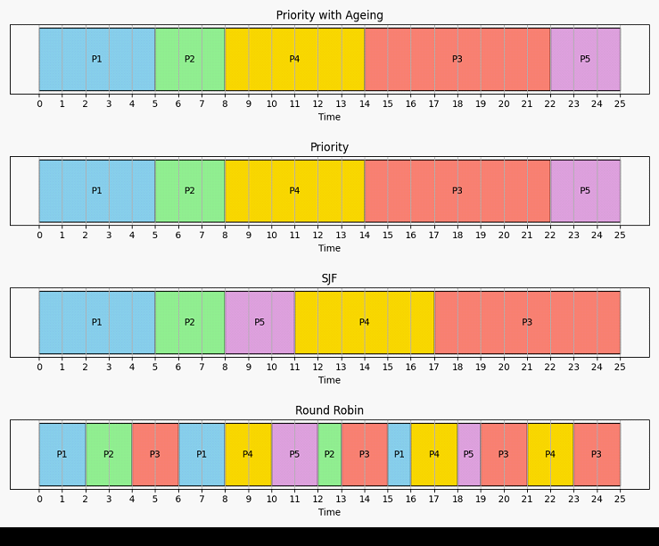

EduOS Simulator
Module Information
•	Project Title: EduOS Multi-Component Operating System Simulator
•	Module Code: 351 CS 2104
•	Module Name: Operating Systems
•	Student Name: Samuel Francis
•	Registration Number: 25311351017
EduOS is a multi-component operating system simulator developed using both C and Python. The simulator demonstrates operating system concepts including process management, CPU scheduling, threading, synchronization, interprocess communication, race conditions, deadlocks, and process scheduling visualization. The project integrates low-level system programming with high-level scheduling simulations and graphical analysis.
________________________________________
Prerequisites
Before running the project, install the following software:
Required Software
C Development
•	GCC Compiler (MinGW-w64 for Windows)
•	POSIX pthread support
•	Make utility
Python Development
•	Python 3.10+
•	pip package manager
Python Libraries
Install dependencies using:
pip install -r requirements.txt
Required libraries:
•	matplotlib
•	pandas
•	tabulate
________________________________________
Step-by-Step Build Instructions
1. Clone Repository
git clone https://github.com/Samuelsongmiao-droid
/OperatingSystem-Assignment.git
cd OperatingSystem-Assignment
________________________________________
2. Compile the C Core
Navigate into the C directory:
cd c_core
Compile the project:
make
Run the simulator:
./eduos
________________________________________
3. Run Race Condition Demonstration
Without mutex protection:
make race
./race
With mutex protection:
make fixed
./fixed
________________________________________
4. Run Memory Leak Check
make memcheck
________________________________________
5. Run Python Scheduler
Navigate to the Python scheduler:
cd ../python_scheduler
Run scheduler using CSV input:
python scheduler_sim.py --file sample_processes.csv
Run Round Robin with custom quantum:
python scheduler_sim.py --file sample_processes.csv --quantum 2
Generate random processes:
python scheduler_sim.py --random 10
________________________________________
6. Run Integration Controller
Navigate to controller folder:
cd ../controller
Run controller:
python main_controller.py
________________________________________
Annotated Directory Tree
OperatingSystem-Assignment/
│
├── README.md
│   → Project documentation and instructions
│
├── .gitignore
│   → Ignores compiled files, cache files, and virtual environments
│
├── docs/
│   ├── report.pdf
│   │   → Final project report
│   │
│   └── screenshots/
│       → Gantt charts and simulator screenshots
│
├── c_core/
│   ├── Makefile
│   │   → Build automation for C project
│   │
│   ├── include/
│   │   └── eduos.h
│   │       → Shared PCB structure and function declarations
│   │
│   ├── process_manager.c
│   │   → PCB management and process simulation
│   │
│   ├── thread_manager.c
│   │   → Thread pools, race conditions, synchronization
│   │
│   ├── ipc_module.c
│   │   → Shared memory and pipe communication
│   │
│   └── main_sim.c
│       → Main driver for simulator execution
│
├── python_scheduler/
│   ├── scheduler_sim.py
│   │   → FCFS, SJF, Priority, and Round Robin algorithms
│   │
│   ├── gantt.py
│   │   → Generates Gantt charts using matplotlib
│   │
│   ├── sample_processes.csv
│   │   → Sample process dataset
│   │
│   └── requirements.txt
│       → Python dependencies
│
└── controller/
    └── main_controller.py
        → Integrates C simulator and Python scheduler
________________________________________
Screenshots
Screenshot 1 — PCB Process Table
  
git
 
________________________________________
Screenshot 2 — Gantt Chart Visualization
  
________________________________________
Valgrind Output
Final memory check output:
==1234== HEAP SUMMARY:
==1234==     in use at exit: 0 bytes in 0 blocks
==1234==   total heap usage: 10 allocs, 10 frees
==1234==
==1234== All heap blocks were freed -- no leaks are possible
==1234==
==1234== ERROR SUMMARY: 0 errors from 0 contexts
________________________________________
Challenges Encountered and Solutions
1. GCC Compiler Not Detected
Problem
The terminal displayed:
gcc is not recognized as an internal or external command
Solution
•	Installed MinGW-w64
•	Added GCC bin directory to Windows PATH
•	Verified installation using:
gcc --version
________________________________________
2. Race Condition Errors
Problem
Multiple threads updated the same counter simultaneously causing inconsistent values.
Solution
Implemented mutex synchronization using:
pthread_mutex_lock(&lock);
counter++;
pthread_mutex_unlock(&lock);
________________________________________
3. JSON Serialization in C
Problem
Generating valid JSON manually was difficult.
Solution
Used carefully formatted fprintf() statements and repeatedly validated JSON structure.
________________________________________
4. Python and C Integration Timing Issues
Problem
Python attempted to read pcb_snapshot.json before it was fully written.
Solution
Implemented:
•	Continuous monitoring
•	Exception handling
•	Delays using time.sleep()
________________________________________
Scheduling Algorithms Implemented
The simulator implements the following algorithms:
•	FCFS (First Come First Served)
•	SJF (Shortest Job First)
•	Priority Scheduling with Ageing
•	Round Robin Scheduling
Metrics calculated:
•	Waiting Time
•	Turnaround Time
•	Response Time
•	CPU Utilization
•	Throughput
________________________________________
Operating System Concepts Demonstrated
•	Process Control Blocks (PCB)
•	System Calls
•	Threading Models
•	Race Conditions
•	Deadlocks
•	Semaphores
•	Shared Memory
•	Pipes
•	CPU Scheduling
•	Synchronization
•	Process Isolation
________________________________________
References
1.	Operating System Concepts — Silberschatz
2.	Linux Man Pages
3.	POSIX Threads Documentation
4.	Python Documentation
5.	GCC Documentation
6.	Matplotlib Documentation
7.	Course Notes and Lecture Slides
________________________________________
GitHub Commit Examples
git commit -m "Added PCB process manager"
git commit -m "Implemented Round Robin scheduler"
git commit -m "Added shared memory IPC"
git commit -m "Fixed race condition using mutex"
________________________________________
Author
•	Student Name: SAMUEL FRANCIS
•	Registration Number: 25311351017
•	Module: 351 CS 2104 Operating System
report pdf [EduOS_Report.pdf](../EduOS_Report.pdf)
